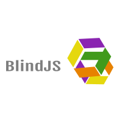

<h1>BlindJS</h1>
<h3 style="text-transform: uppercase">The no code mistakes tool for presenters</h3>
BlindJS is an extremely useful tool for <u>lectures, lessons and presentations</u>. 
It allows you to write code samples quickly and without any chance for mistakes. 
BlindJS is a Javascript library that replaces <u>content</u> with <u>pre-defined code</u> in your text editor or web page.

<h3>Quick install</h3>
Include the Javascript code before <pre>&lt;/body&gt;</pre>:

Create a wrapper and insert your code:

<pre>
&lt;div id="divElement"&gt;
    function func(){
        alert("Super Awesome!");
    }
&lt;/div&gt;
</pre>

Add textarea placeholder:

<pre>
&lt;textarea id="textareaElement"&gt;
&lt;/textarea&gt;
</pre>

Start BlindJS with reference to:
<ol>
<li>input text</li>
<li>output element</li>
</ol>

<pre>
BlindJS.start({
input: divElement.innerText,
output: textareaElement
});
</pre>

<h3>IDE Support</h3>
New! BlindJS is enabled in <a href="http://download.brackets.io" target="_blank">Adobe Brackets</a>.
Check out the extension: <a href="https://github.com/ShaiMesisterano/brackets-blindjs">https://github.com/ShaiMesisterano/brackets-blindjs</a>

<h3>About</h3>
BlindJS is created by <a href="http://www.mcterano.com/blog" title="Shai Mesisterano">Shai Mesisterano</a> and is licensed under <a href="https://raw.github.com/ShaiMesisterano/BlindJS/master/LICENSE" title="MIT LICENSE">MIT</a>.
